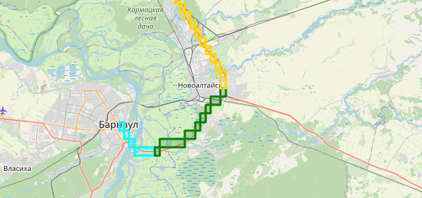

# Модель заказа
[order.model.ts](order.model.ts)

## Описание

Модель сожержит в себе `id`, полезные данные (`data`) и прочую служебную информацию 

поле `coords` в поле `waypoints` содержит в себе квадраты пути. 
Формат `coords` - строка вида из векторов, разделенных `;`. Каждый вектор имеет вид `latitude,longitude,npb`
где после longitude первая буква и вторая буквы кодируют вектор символами одна из набора nop

`n` - negative
`o` - zero
`p` - positive

Последняя буква кодирует действие:
`n` - nothing (ничего не делаем, это просто ребро)
`o` - output (разгрузка)
`i` - input (загрузка)
`b` - both (и загрузка, и разгрузка)

### Квадраты пути
В поле `geometry` из OSRM содержатся координаты пути, соответствующие нодам. 
Каждая координата округляется до нескольких (в нашем случае 2) чисел после запятой,
после чего маршрут выглядит как множество квадратов (точки попадают либо в один, либо в другой квадрат)

Затем добавим каждому квадрату направление, узнав, с какой стороны находится следующий квадрат.

// TODO
в Route.model нужно к квадратам добавить вес.

